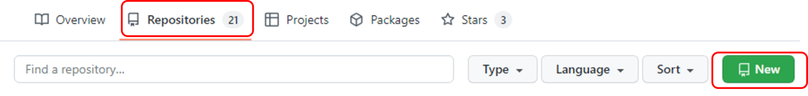
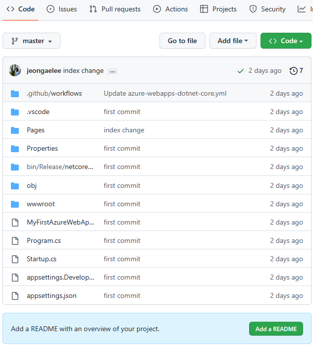

# Azure DevOps Hands-on Lab with GitHub Actions

## Step 2. GitHub Repository에 코드 업로드
1. https://github.com/<myrepository>의 "Repositories" 메뉴에서 "New"를 클릭하여 새로운 Repository를 생성합니다.

    

2. Owner와 Repository name을 설정하고 나머지는 기본값으로 유지 후 "Create repository" 버튼을 눌러서 새로운 Repository를 생성합니다.

3. Visual Studio Code의 터미널 혹은 Git Bash를 실행 할 수 있는 Command 창에서 아래의 Git 명령어를 차례로 실행하여 로컬에 있는 코드를 #2에서 생성항 Repository에 업로드 합니다.

```
    git init
    git add . 
    git commit -am "first commit"
    git remote add origin <My Repository>
    git push -u origin master
```

4. <My Repository>에 MyFirstAzureWebApp 코드가 업로드 (Push) 되었는지 확인합니다.

    


## 실습 순서

* [Step 1. Azure에서 ASP.NET Core 웹앱 만들기](https://github.com/jeongaelee/ProjectJourneyModule7-GitHubActions/blob/master/step1.md)
* [Step 2. GitHub Repository에 코드 업로드](https://github.com/jeongaelee/ProjectJourneyModule7-GitHubActions/blob/master/step2.md)
* [Step 3. GitHub Actions CI/CD 파이프라인 구성 - Build](https://github.com/ProjectJourneyModule7-GitHubActions/blob/master/step3.md)
* [Step 4. GitHub Actions CI/CD 파이프라인 구성 - Deploy](https://github.com/ProjectJourneyModule7-GitHubActions/blob/master/step4.md)
* [Step 5. CodeQL을 이용하여 코드 보안 검사](https://github.com/jeongaelee/ProjectJourneyModule7-GitHubActions/blob/master/step5.md)
* [Step 6. Step 6. GitHub Actions 워크플로에서 Key Vault Secret(비밀) 사용](https://github.com/jeongaelee/ProjectJourneyModule7-GitHubActions/blob/master/step6.md)
