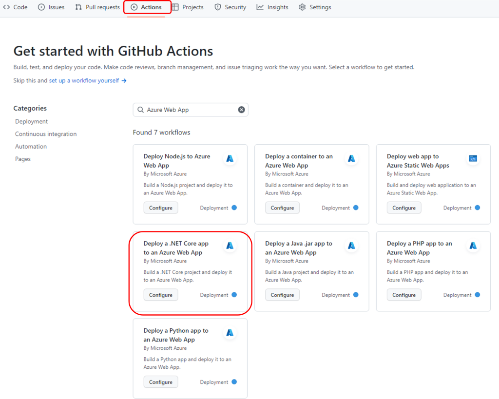
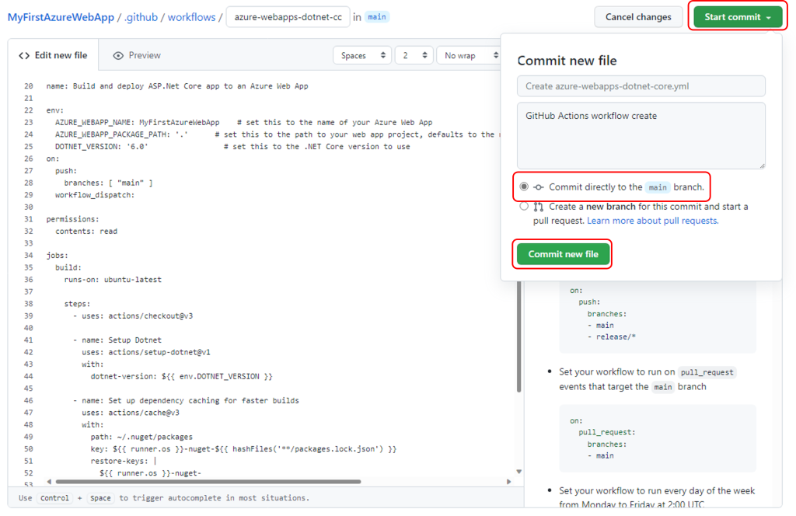
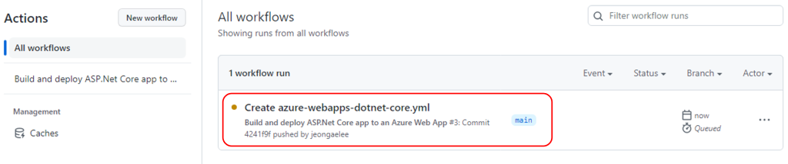
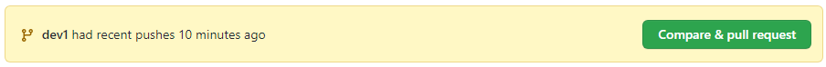
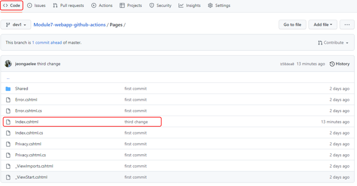
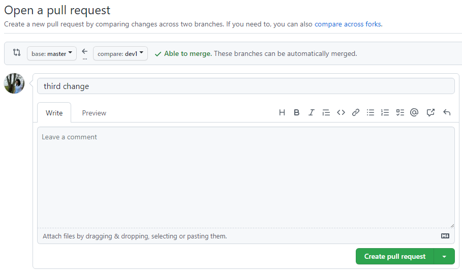
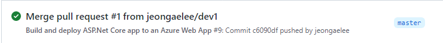

# Azure DevOps Hands-on Lab with GitHub Actions

## Step 3. GitHub Actions CI/CD 파이프라인 구성 I
1. GitHub의 "Actions" 메뉴에서 GitHub Actions Workflow를 생성한다. 검색창에 "Azure Web App"으로 검색하여 "Deploy a .NET Core app to an Azure Web App"을 찾은 후 "Configure" 버튼을 클릭하면, azure-webapps-dotnet-core.yml 아래에 .NET Core Web App을 Azure에 디플로이 하기 위한 워크플로우가 구성됩니다. 

    

2. YAML 파일의 "env:" 항목을 아래와 같이 구성합니다.

```
env:
  AZURE_WEBAPP_NAME: MyFirstAzureWebApp    # set this to the name of your Azure Web App
  AZURE_WEBAPP_PACKAGE_PATH: '.'      # set this to the path to your web app project, defaults to the repository root
  DOTNET_VERSION: '6.0'                 # set this to the .NET Core version to use
```

3. CI 파이프라인의 BUILD를 아래와 같이 구성합니다.
```
jobs:
  build:
    runs-on: ubuntu-latest

    steps:
      - uses: actions/checkout@v3

      - name: Setup Dotnet
        uses: actions/setup-dotnet@v1
        with:
          dotnet-version: ${{ env.DOTNET_VERSION }}
          
      - name: Set up dependency caching for faster builds
        uses: actions/cache@v3
        with:
          path: ~/.nuget/packages
          key: ${{ runner.os }}-nuget-${{ hashFiles('**/packages.lock.json') }}
          restore-keys: |
            ${{ runner.os }}-nuget-
      - name: Build with dotnet
        run: dotnet build --configuration Release

      - name: dotnet publish
        run: dotnet publish -c Release -o ${{env.DOTNET_ROOT}}/myapp

      - name: Upload artifact for deployment job
        uses: actions/upload-artifact@v3
        with:
          name: .net-app
          path: ${{env.DOTNET_ROOT}}/myapp
```

4. GitHub Actions workflow 파일의 이름과 내용을 확인 후 "Start commit" 버튼을 누른다. 본 실습 단계까지는 main 브랜치에 바로 Commit 할 것이므로 "Commit directly to the main branch."를 선택하고 commit 메세지를 입력 후 "Commit new file"를 클릭합니다.

    

5. "<> Code" 메뉴의 ".github/workflows" 폴더 아래에 "Create azure-webapps-dotnet-core.yml"이 생성된 것을 확인 할 수 있다. "Actions" 메뉴에 아래와 같이 "Build and deploy ASP.Net Core app to an Azure Web App" 워크플로우가 실행되는 것을 확인합니다.

    

6. 여기까지는 master 브랜치에 직접 코드를 Push 하였으나, 실제 개발 환경에서는 master (혹은 main) 브랜치에서 직접 개발을 하는 경우는 없다. 아래의 명령어를 차례로 실행하여 개발(dev1) 브랜치를 생성하고, dev1 브랜치에서 코드를 수정한 후 GitHub에 Push 한 후 master 브랜치에 Pull Request를 생성하여 Merge 합니다.

    ```
    git branch dev1
    git checkout dev1
    git branch
    git add .
    git commit -m "add change in dev1 branch"
    git push origin dev1
    ```

7. Push후 GitHub 리파지토리의 "Code" 메뉴를 확인하면 아래와 같이 dev1 브랜치가 생성되었고, dev1 브랜치에 코드가 Push 되었음을 확인할 수 있습니다.

    

    

8. "Compare & pull request" 버튼을 클릭하여 Pull Request를 생성합니다.

    

9. "Pull Request" 메뉴에서 Pull Request를 확인하고 "Create pull request" 버튼을 클릭하여 Pull Request를 Merge 한다. 확인 후 "Delete branch" 버튼을 클릭하여 dev1 브랜치를 삭제한다. 리파지토리의 "Actions" 메뉴에 아래와 같이 "Merge pull request #1 from jeongaelee/dev1" 워크플로우가 실행되는 것을 확인합니다.

    


## 실습 순서

* [Step 1. Azure에서 ASP.NET Core 웹앱 만들기](https://github.com/jeongaelee/Module7-webapp-github-actions/blob/master/step1.md)
* [Step 2. GitHub Repository에 코드 업로드](https://github.com/jeongaelee/Module7-webapp-github-actions/blob/master/step2.md)
* [Step 3. GitHub Actions CI/CD 파이프라인 구성 - Build](https://github.com/jeongaelee/Module7-webapp-github-actions/blob/master/step3.md)
* [Step 4. GitHub Actions CI/CD 파이프라인 구성 - Deploy](https://github.com/jeongaelee/Module7-webapp-github-actions/blob/master/step4.md)
* [Step 5. CodeQL을 이용하여 코드 보안 검사](https://github.com/jeongaelee/Module7-webapp-github-actions/blob/master/step5.md)
* [Step 6. Step 6. GitHub Actions 워크플로에서 Key Vault Secret(비밀) 사용](https://github.com/jeongaelee/Module7-webapp-github-actions/blob/master/step6.md)