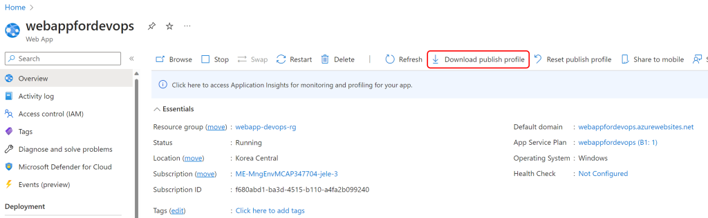
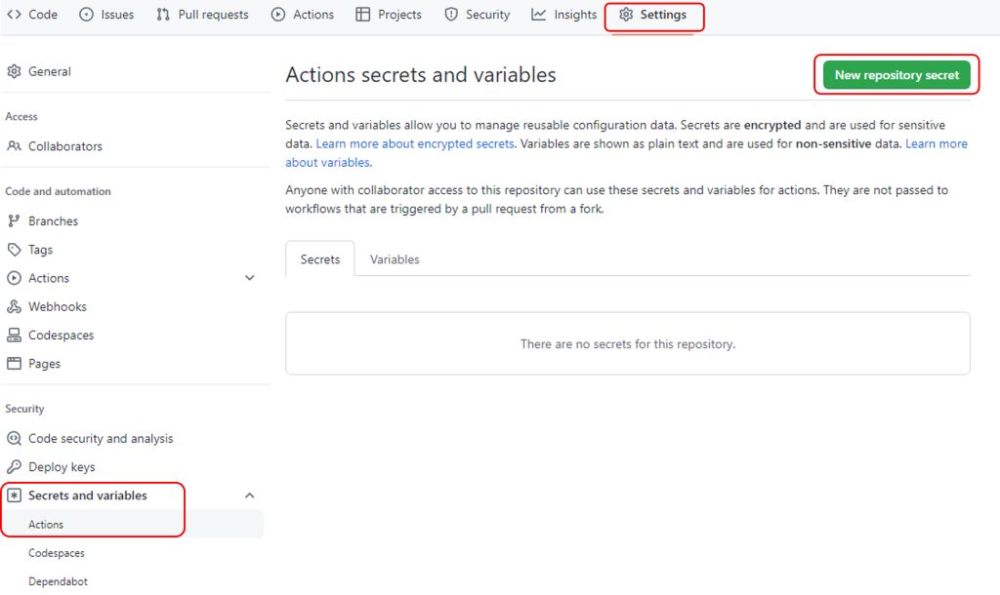

# Azure DevOps Hands-on Lab with GitHub Actions

## Step 4. GitHub Actions CI/CD 파이프라인 구성 II

Step 4에서는 이전에 빌드된 웹앱 패키지를 Azure의 App Service에 배포하는 파이프라인을 구성합니다.

1. 배포 자격 증명 (Deployment Credentials)을 생성합니다.

GitHub Actions용 Azure App Service를 사용하여 인증하려면 게시 프로필을 사용하는 것이 좋습니다. 서비스 주체 또는 오픈 ID 커넥트를 사용하여 인증할 수도 있지만 이 프로세스에는 추가 단계가 필요합니다.

Azure 인증을 할 수 있도록 Publish Profile 자격 증명이나 서비스 주체를 [GitHub Secret](https://docs.github.com/en/actions/security-guides/encrypted-secrets)으로 저장하여 워크플로우 내의 Secret에 액세스합니다.

    > Publish Profile은 앱-레벨의 자격 증명입니다. Publish Profile을 GitHub Secret으로 설정합니다.
        > Azure Portal에서 해당 앱 서비스로 이동합니다.
        > 개요 페이지에서 게시 프로필 가져오기를 선택합니다.
        > 다운로드한 파일을 저장합니다. 파일의 내용을 사용하여 GitHub 비밀을 만듭니다.

Azure Portal에서 아래 그림과 같이 다운받으시면 됩니다.
    

2. GitHub Secret에 Publish Profile을 등록합니다.

리파지토리에서 "Settings > Security > Secrets and variables > Actions > New repository secret"을 선택합니다.



Name에 "AZURE_WEBAPP_PUBLISH_PROFILE"를 입력하고 "Secret" 값에 다운로드 받은 파일의 전체 텍스트를 복사하여 붙여넣기 합니다.

3. GitHub Actions의 워크플로우에 웹앱을 App Service에 배포하는 작업을 추가합니다.

  ```
  deploy:
    permissions:
      contents: none
    runs-on: ubuntu-latest
    needs: build
    environment:
      name: 'Development'
      url: ${{ steps.deploy-to-webapp.outputs.webapp-url }}

    steps:
      - name: Download artifact from build job
        uses: actions/download-artifact@v3
        with:
          name: .net-app

      - name: Deploy to Azure Web App
        id: deploy-to-webapp
        uses: azure/webapps-deploy@v2
        with:
          app-name: ${{ env.AZURE_WEBAPP_NAME }}
          publish-profile: ${{ secrets.AZURE_WEBAPP_PUBLISH_PROFILE }}
          package: ${{ env.AZURE_WEBAPP_PACKAGE_PATH }}
  ```


  *[참고: Events that trigger workflows](https://docs.github.com/en/actions/using-workflows/events-that-trigger-workflows#running-your-workflow-when-a-pull-request-merges)


## 실습 순서

* [Step 1. Azure에서 ASP.NET Core 웹앱 만들기](https://github.com/jeongaelee/Module7-webapp-github-actions/blob/master/step1.md)
* [Step 2. GitHub Repository에 코드 업로드](https://github.com/jeongaelee/Module7-webapp-github-actions/blob/master/step2.md)
* [Step 3. GitHub Actions CI/CD 파이프라인 구성 - Build](https://github.com/jeongaelee/Module7-webapp-github-actions/blob/master/step3.md)
* [Step 4. GitHub Actions CI/CD 파이프라인 구성 - Deploy](https://github.com/jeongaelee/Module7-webapp-github-actions/blob/master/step4.md)
* [Step 5. CodeQL을 이용하여 코드 보안 검사](https://github.com/jeongaelee/Module7-webapp-github-actions/blob/master/step5.md)
* [Step 6. Step 6. GitHub Actions 워크플로에서 Key Vault Secret(비밀) 사용](https://github.com/jeongaelee/Module7-webapp-github-actions/blob/master/step6.md)