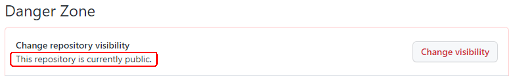
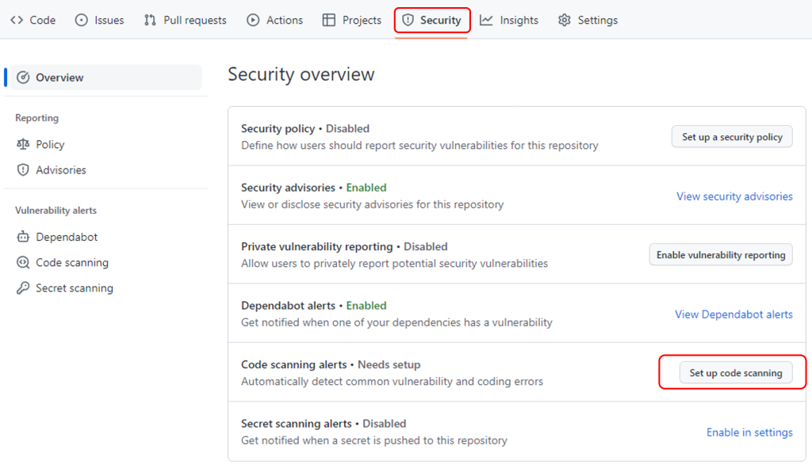
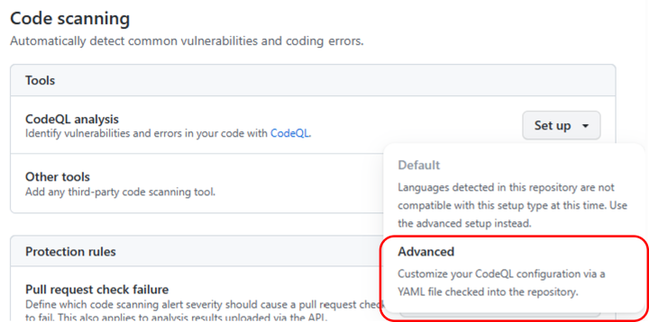
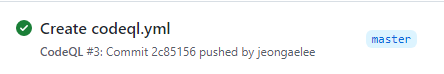
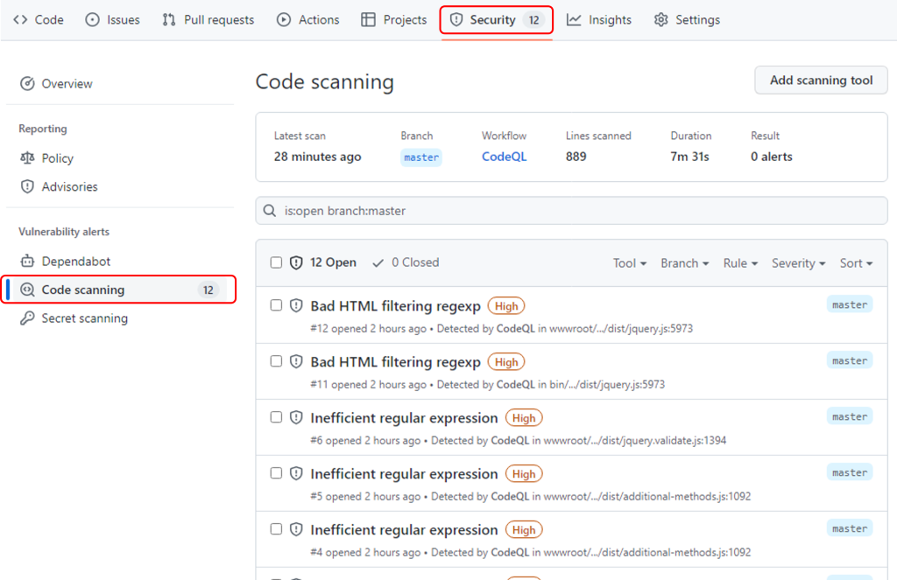

# Azure DevOps Hands-on Lab with GitHub Actions

## Step 5. CodeQL을 이용하여 코드 보안 검사 

GitHub CodeQL은 개발자가 보안 검사를 자동화하고 보안 분석가가 여러가지 분석을 수행하기 위해 사용하는 분석 엔진이다. CodeQL에서 코드는 데이터처럼 취급되어 보안 취약성, 버그 및 기타 오류가 코드에서 추출되서 데이터베이스에 실행 할 수 있는 쿼리로 모델링됩니다. CodeQL은 이러한 쿼리를 사용하여 코드를 분석하고 결과를 보고한다.

* [참고] CodeQL을 사용하기 위해서 GitHub 리파지토리의 Visibility가 Public으로 설정되어야 합니다. 리파지토리에서 "Settings > General"의 맨 아래에서 다음과 같이 확인 할 수 있습니다.

    

1. 리파지토리의 "Security" 탭에서 "Code scanning alerts"의 "Set up code scanning"을 클릭합니다.

    

2. CodeQL anlysis의 "Set up"의 "Advanced" 옵션을 선택하여 Code Scanning을 위한 워크플로우를 추가합니다. 코드 스캔의 스케줄을 설정하려면 cron 값을 설정하시면 됩니다. 본 Step에서는 스케줄 설정 없이 1회만 실행하도록 설정합니다. 

    

3. 아래와 같이 master 브랜치에 push 혹은 pull_request가 있을 경우 Code Scan이 이루어지도록 YAML 파일을 구성합니다. 언어는 csharp이며, CodeQL의 기본 쿼리셋을 사용합니다. 워크플로우 구성이 끝나면 Commit changes 버튼을 클릭합니다.

    ```
    name: "CodeQL"

    on:
    push:
        branches: [ "master" ]
    pull_request:
        # The branches below must be a subset of the branches above
        branches: [ "master" ]

    jobs:
    analyze:
        name: Analyze
        runs-on: ubuntu-latest
        permissions:
        actions: read
        contents: read
        security-events: write

        strategy:
        fail-fast: false
        matrix:
            language: [ 'csharp' ]

        steps:
        - name: Checkout repository
        uses: actions/checkout@v3

        # Initializes the CodeQL tools for scanning.
        - name: Initialize CodeQL
        uses: github/codeql-action/init@v2
        with:
            languages: ${{ matrix.language }}

        - name: Perform CodeQL Analysis
        uses: github/codeql-action/analyze@v2
        with:
            category: "/language:${{matrix.language}}"
    ```
4. "Actions" 탭으로 가면 "Create codesql.yml"의 워크플로우가 실행되는 것을 확인할 수 있습니다. 

    

5. "Security" 탭으로 가면 "Code scanning" 메뉴에 CodeQL의 결과가 표시됩니다. 

    

6. index.cshtml 파일을 수정 한 후 [Step 3. GitHub Actions CI/CD 파이프라인 구성 - Build](https://github.com/jeongaelee/Module7-webapp-github-actions/blob/master/step3.md)의 6번에서 수행하였던 아래의 Git 명령어로 코드를 Commit & Push 한 후 Merge & Pull Request를 수행합니다.

```
    git add .
    git commit -m "modify index.cshtml in dev1 branch"
    git push origin dev1
```

## 실습 순서

* [Step 1. Azure에서 ASP.NET Core 웹앱 만들기](https://github.com/jeongaelee/Module7-webapp-github-actions/blob/master/step1.md)
* [Step 2. GitHub Repository에 코드 업로드](https://github.com/jeongaelee/Module7-webapp-github-actions/blob/master/step2.md)
* [Step 3. GitHub Actions CI/CD 파이프라인 구성 - Build](https://github.com/jeongaelee/Module7-webapp-github-actions/blob/master/step3.md)
* [Step 4. GitHub Actions CI/CD 파이프라인 구성 - Deploy](https://github.com/jeongaelee/Module7-webapp-github-actions/blob/master/step4.md)
* [Step 5. CodeQL을 이용하여 코드 보안 검사](https://github.com/jeongaelee/Module7-webapp-github-actions/blob/master/step5.md)