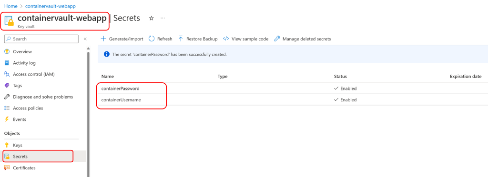
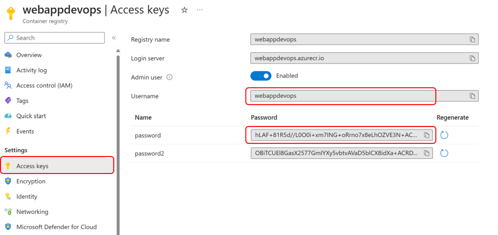
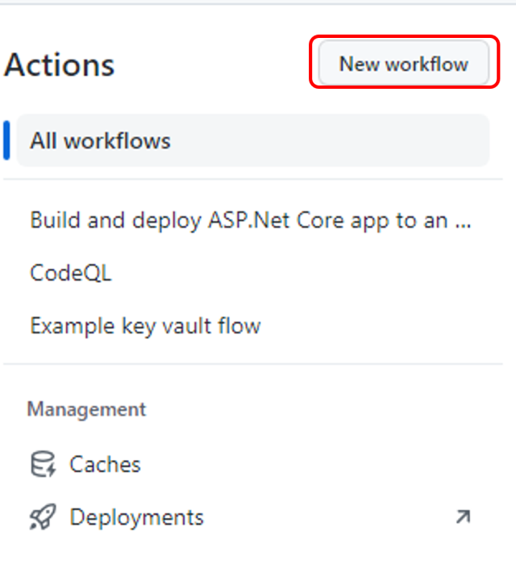
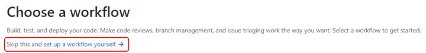
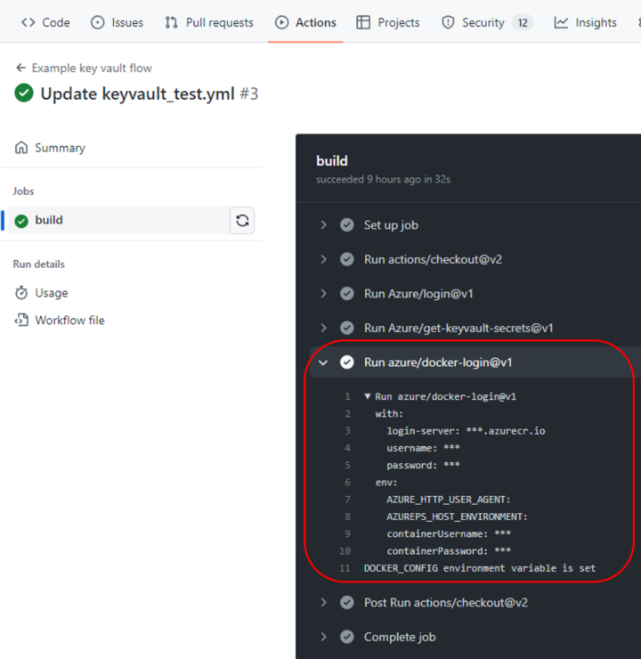

# Azure DevOps Hands-on Lab with GitHub Actions

## Step 6. GitHub Actions 워크플로에서 Key Vault Secret(비밀) 사용

Step 6에서는 Azure Container Registry에 로그인하는 Username과 Password를 Key Vault Secret에 저장하고, GitHub Actions 워크플로에서 Key Vault Secret(비밀)을 사용하는 방법에 대해서 실습해봅니다.

* 전체 워크플로우는 [GitHub Actions 워크플로에서 Key Vault 비밀 사용](https://learn.microsoft.com/ko-kr/azure/developer/github/github-key-vault)로 구성하여야 하나, 본 Step에서는 단순히 GitHub Actions에서 Key Vault를 사용하는 부분만을 학습하는 목적으로 [Azure App Service에 컨테이너를 배포](https://learn.microsoft.com/ko-kr/azure/developer/javascript/tutorial/tutorial-vscode-docker-node/tutorial-vscode-docker-node-01)하는 부분은 스킵하고, Container Registry에 로그인하는 step만 구성하도록 합니다.

1. 서비스 주체 (Service Principal)을 정의합니다. Azure Portal의 Cloudshell을 열어서 아래의 Azure CLI를 실행하여 서비스 주체를 만듭니다. "myApp", "subscription-id", "resourceGroups"를 작업중인 Azure 구독과 앱 이름에 맞게 변경합니다.

    > az ad sp create-for-rbac --name {myApp} --role contributor --scopes /subscriptions/{subscription-id}/resourceGroups/{MyResourceGroup} --sdk-auth

2. #1을 실행하면 Azure CLI가 아래의 형태로 JSON 형식으로 서비스 주체를 반환합니다. 이를 복사하여 GitHub Secret에 등록합니다. "AZURE_CREDENTIALS"라는 이름으로 등록합니다.
    > {
    >   "clientId": "<GUID>",
    >   "clientSecret": "<GUID>",
    >   "subscriptionId": "<GUID>",
    >   "tenantId": "<GUID>",
    >   (...)
    > }

3. GitHub Actions의 Secret을 생성합니다. GitHub의 리포지토리로 이동하여 "Setting > Secrets and variables > Actions" 메뉴에서 "New repository secret" 메뉴를 선택하여 새로운 Secret을 생성합니다. Name 항목에 "AZURE_CREDENTIALS"을 입력하고, Secret 항목에 #2에서 복사한 JSON 형식의 서비스 주체를 붙여넣기 합니다.

    

4. Azure Portal에서 Azure Container Registry를 생성합니다. 생성된 Container Registry의 "Access keys" 메뉴에서 Username과 password를 복사하여 Key Vault의 Secret을 생성할 것입니다.
    
    

5. Azure Portal에서 Key Vault를 생성하고 Key Vault의 "Secret" 메뉴에서 containerUsername, containerPassword를 생성합니다. #4에서 복사한 Username과 password 값을 입력합니다.

    

6. Azure Portal의 Cloudshell을 열어서 역할 할당 (role assignment) 추가합니다. 키 자격 증명 모음에 액세스할 수 있도록 Azure 서비스 주체에 대한 get과 list 액세스 권한을 부여합니다. #5에서 생성한 Key Vault의 이름을 "keyVaultName"에 넣고, #1에서 출력한 서비스 주체의 clientId를 "clientIdGUID"에 넣습니다.

    > az keyvault set-policy -n {keyVaultName} --secret-permissions get list --spn {clientIdGUID}

7. GitHub Actions의 워크플로우에서 키 자격 증명 모음 비밀 (Key Vault Secret)을 참조하여 Azure Container Registry에 로그인 하는 job을 추가합니다.

    먼저, 리파지토리의 "Actions" 메뉴에서 "New workflow"를 클릭하여 새로운 워크플로우를 생성합니다.
    
    

    "set up a workflow yourself"를 선택하여 새로운 워크플로우 파일을 열어 아래의 워크플로우를 복사하여 붙여넣기 합니다. "keyvault"에 #5에서 생성한 Key Vault의 이름을 넣습니다.

    

```
    name: Example key vault flow

    on: [push]

    jobs:
    build:
        runs-on: ubuntu-latest
        steps:
        # checkout the repo
        - uses: actions/checkout@v2
        - uses: Azure/login@v1
        with:
            creds: ${{ secrets.AZURE_CREDENTIALS }}
        - uses: Azure/get-keyvault-secrets@v1
        with: 
            keyvault: "containervault-webapp"
            secrets: 'containerPassword, containerUsername'
        id: myGetSecretAction
        - uses: azure/docker-login@v1
        with:
            login-server: ${{ steps.myGetSecretAction.outputs.containerUsername }}.azurecr.io
            username: ${{ steps.myGetSecretAction.outputs.containerUsername }}
            password: ${{ steps.myGetSecretAction.outputs.containerPassword }}
```

8. "Actions"에서 새로운 워크플로우가 실행되는 것을 확인하고 로그를 확인하여 Azure Container Registry에 로그인 되는 것을 확인합니다.

    

## 실습 순서

* [Step 1. Azure에서 ASP.NET Core 웹앱 만들기](https://github.com/jeongaelee/Module7-webapp-github-actions/blob/master/step1.md)
* [Step 2. GitHub Repository에 코드 업로드](https://github.com/jeongaelee/Module7-webapp-github-actions/blob/master/step2.md)
* [Step 3. GitHub Actions CI/CD 파이프라인 구성 - Build](https://github.com/jeongaelee/Module7-webapp-github-actions/blob/master/step3.md)
* [Step 4. GitHub Actions CI/CD 파이프라인 구성 - Deploy](https://github.com/jeongaelee/Module7-webapp-github-actions/blob/master/step4.md)
* [Step 5. CodeQL을 이용하여 코드 보안 검사](https://github.com/jeongaelee/Module7-webapp-github-actions/blob/master/step5.md)
* [Step 6. Step 6. GitHub Actions 워크플로에서 Key Vault Secret(비밀) 사용](https://github.com/jeongaelee/Module7-webapp-github-actions/blob/master/step6.md)